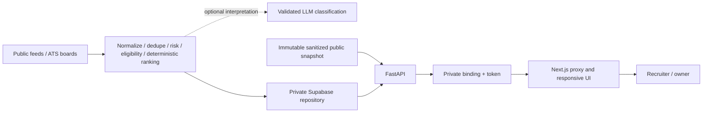

# Technical Architecture

## Resume Release Deployment

InternAI uses current Vercel Services: Next.js frontend receives the sole public rewrite; FastAPI `app.main:app` stays internal. A caller-declared BACKEND_URL binding and server-only API_TOKEN connect them. Node middleware preserves host/password checks without unsupported Edge output.

The public demo never reads private owner persistence, even if Supabase credentials exist. It serves a generic profile and fresh objects from a timestamped snapshot. Proxy and backend deny mutations; repository rejects writes. No public raw state endpoint exists. Tracking UI is disabled and notes/contact/corrections are absent. Private workflow remains separately tested.

Writable production startup requires Supabase and a backend token; local JSON fallback is forbidden. Hosted database verification and daily cron are not claimed for snapshot deployment. [Deployment details](docs/DEPLOYMENT.md) and [Current Status](docs/CURRENT_STATUS.md) supersede historical stage reports.

## Current Flow

Next.js/React workspace -> same-origin private API proxy -> FastAPI -> local JSON or Supabase repository.

Discovery button and `backend/scripts/discover.py` call the same runner. Persisted runs acquire an owner/expiry lease in locked local state or PostgreSQL. A total timeout is shorter than the lease; stale running records are marked cancelled. Six enabled public adapters fetch bounded batches. Operator `ENABLED_SOURCES` is the runtime authority; legacy SQL source flags are informational.

Raw records -> normalization -> listing trust/risk -> lifecycle -> profile eligibility/fit -> internship rejection -> optional evidence-validated AI extraction -> conservative indexed merge -> re-score affected records -> persist jobs/raw/run diagnostics. Supabase completion is one transactional RPC; local JSON uses atomic per-file replacement and a shared host file lock, not a cross-file transaction.

## Providers

RemoteOK reads public JSON once; YC parses the public page's structured `jobPostings` and selectively reads candidate JSON-LD details. YC currently exposes only 20 postings with no verified pagination. Trackers use configurable seasonal README URLs, detect table headers, skip closed rows and fairly interleave sources. Greenhouse fetches configured board lists, fairly selects candidates and requests per-job detail with pay transparency. The program catalog parses a public Markdown README table with fixed columns; it remains separately typed and inactive when opening state is unknown. Neither disabled restricted source is scraped.

## Ranking

Match = required skills 40 + role 25 + explicit experience 15 + remote preference 10 + paid preference 10. Required skills use matched/known ratio; preferred skills consume only 5% of the skill component when both kinds are known. Unknown requirements and experience receive zero evidence credit. Unknown requirements cap match at 59; weak (<75%) required coverage caps at 64; explicit eligibility conflict caps at 49. Geography conflicts prevent high-priority recommendation.

Fit is the skills/role/experience subtotal normalized to 100, or null when required skills are unknown. Evidence confidence is a completeness heuristic, not calibrated statistical confidence: required skills 40, substantial description 20 (thin 5), explicit experience 10, degree/graduation 10, geography 10, known compensation 10. Preference compliance separately reports paid/remote/geography/role as matches, conflicts or unknown.

Opportunity = match 45% + eligibility 20% + listing trust 15% + freshness 15% + urgency 5%, rounded per component. Strong Match requires match >=75, normal risk, >=75% required coverage, aligned preferences, confidence >=65, and no known eligibility conflict. Apply Now additionally requires match >=85, likely eligible, trust >=65 and confidence >=80. Ineligible listings cannot be Worth Exploring.

Risk signals quarantine application fees/deposits, messaging-only recruitment and guaranteed earnings. Clause-level negation avoids benign fee statements. Invalid application URLs and configured exclusions are blocked. Identity evidence (HTTPS, ATS, supplied domain agreement, named company) is stored separately from listing penalties. These numbers are not legitimacy probabilities or independently verified identity.

## Persistence And Scale

Personal tracking and corrections survive rediscovery. Specific URLs, provider IDs and Greenhouse requisition aliases index deduplication; generic careers URLs never establish identity. Cross-source fuzzy matching requires exact company/title/location and strongly similar long descriptions; distinct ATS requisitions remain separate.

V3 adds typed listing score/risk/confidence/application fields, synchronizes intelligence ingestion into those columns, and introduces `job_source_instances`. Reads prefer typed ranking/tracking fields. JSON stores evolving explanations, evidence and provenance. Local state retains 100 runs, 10 raw batches and 1000 AI cache entries. Hosted retention remains operator work.

Listing APIs still load and rank the collection in Python. Measured 10k-job ranking is about 1.7 seconds and peak process RSS about 309MB on this machine; indexed SQL filtering, profile-version score materialization and keyset pagination are required before large or multi-user deployment. Current profile/search/tracking state is single-owner and not tenant-isolated.

## Boundaries

`/health` is process/config only. `/ready` checks repository access without provider calls. Public uploads are limited to 2MB, PDFs to 10 unencrypted pages, extracted text to 50k characters; disposable parser timeout 8s, CPU 5s, Linux address-space cap 512MB. This is not a complete public-upload sandbox.

Numerical scores never come from AI. Optional model skill proposals need confidence and verbatim description evidence; other proposals remain in provenance. No model or hosted database credentials were available for live verification.

No scheduler, notification sender, automatic application, CAPTCHA bypass, production deployment or multi-user account system has been added. See `docs/CURRENT_STATUS.md` and `docs/RELIABILITY_V3_REPORT.md` for current evidence rather than historical screenshots.
