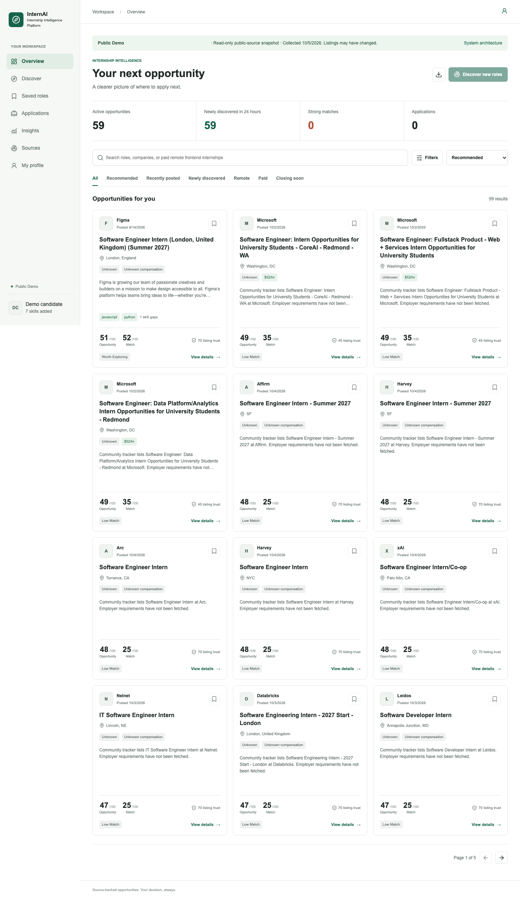
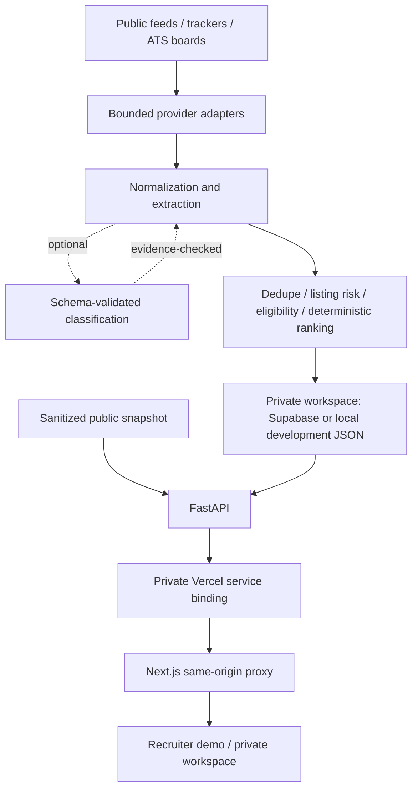

# InternAI

**Internship Intelligence Platform**

A full-stack platform for discovering, evaluating and tracking internships. Multi-source ingestion, explainable candidate ranking, eligibility checks and listing-risk analysis. Numerical ranking is deterministic; LLM-assisted classification is optional.

[Live demo](https://internai-xi.vercel.app) · [Current status](docs/CURRENT_STATUS.md) · [Architecture](ARCHITECTURE.md) · [Resume/interview guide](docs/RESUME_PROJECT.md)

[](https://github.com/oceankumar/Internship-Intelligence-Platform/actions/workflows/reliability.yml)

The public demo is read-only: a timestamped snapshot of real public listings and a generic candidate profile, not private resumes or fabricated jobs. Deployment verification is recorded in Current Status; a link alone is not evidence of a working deployment.



## Features

- Public RemoteOK/YC feeds, Simplify/GitHub trackers and Greenhouse boards. Program catalogs are separate, not open internship inventory.
- Metadata normalization and conservative source-ID, URL and requisition-aware deduplication.
- Explainable candidate fit, skill gaps, evidence completeness, geography, eligibility and preference alignment.
- Company identity evidence separated from listing risk, with high-risk quarantine.
- Search, filtering, unit-aware pay sorting, private tracking, saved searches and corrections; CSV/XLSX export.
- Independent provider health, useful yield and discovery history. Fetch success does not imply useful supply.

## Architecture



The production demo reads an immutable snapshot, **not writable ephemeral filesystem storage**. Writable production requires Supabase. No daily crawler is installed without durable storage.

## Stack

| Layer | Technology |
|---|---|
| Frontend | Next.js 15, React 19, TypeScript, Lucide |
| Backend | Python, FastAPI, Pydantic, httpx |
| Data | PostgreSQL/Supabase adapter, local JSON development adapter, immutable snapshot |
| Intelligence | Deterministic ranking, eligibility, listing risk, optional LLM classifier |
| Infrastructure | Vercel Services, GitHub Actions |
| Tests | Pytest, Playwright, PGlite migration checks, ESLint, TypeScript |

## Local Setup

Requires Node.js 22+ and Python 3.12+. Use `.env.example` for settings. Never commit secrets.

```bash
cd backend
python3 -m venv .venv
.venv/bin/pip install -r requirements.txt
.venv/bin/python -m uvicorn app.main:app --reload --host 127.0.0.1 --port 8000
```

In another terminal:

```bash
cd frontend
npm ci
npm run dev -- --hostname 127.0.0.1
```

Open `http://127.0.0.1:3000`. To use the isolated public snapshot locally, set `PUBLIC_DEMO_MODE=true` for both services. Remote private workspaces require the existing password, host/origin and backend-token protections.

## Tests

```bash
cd backend
.venv/bin/python -m pytest -q
```

```bash
cd frontend
npm ci
npm run lint
npm run typecheck
npm run build
node scripts/test-migration.mjs
node --experimental-strip-types scripts/service-check.mjs
npx playwright install chromium
node scripts/product-smoke.mjs
```

The isolated smoke harness verifies private and read-only demo workflows at 1440px/390px and terminates all test-server process groups. It does not edit owner data. Release coverage expanded from 95 to **112 backend tests**.

## Deployment

Root `vercel.json` declares Next.js and FastAPI services. Only frontend receives public ingress. Runtime `BACKEND_URL` takes precedence over local `API_BASE_URL`; `API_TOKEN` authenticates internal calls. Middleware uses Node, not Edge.

Server-only configuration: `APP_ENV=production`, `PUBLIC_DEMO_MODE=true`, generated `API_TOKEN`, appropriate backend host policy. Frontend accepts exact Vercel-generated deployment/production/branch hosts. No service-role key enters browser code.

Writable production needs `SUPABASE_URL` and `SUPABASE_SERVICE_ROLE_KEY`, hosted backup and careful base-schema/V2/V3 migration/RLS/RPC verification before enabling writes. Local SQL tests do not certify hosted persistence.

[Vercel Services](https://vercel.com/docs/services) · [Private bindings](https://vercel.com/docs/services/bindings) · [Deployment guide](docs/DEPLOYMENT.md)

## Honest Evidence

The October 5, 2026 IST bounded probe returned 68 candidates, accepted 67 including seven catalogs and produced 66 unique records / 59 active-looking internship leads. Fifteen had pay evidence, two were remote and one was explicitly India-compatible. These are snapshot counts, **not daily throughput, matching accuracy or guaranteed openings**.

Hosted Supabase persistence and live LLM quality are not verified. Daily discovery is not installed for the immutable demo. Thin descriptions, seasonal tracker maintenance, foreign-location restrictions and incomplete compensation remain limitations. Multi-user SaaS and auto-apply are out of scope.

Historical engineering evidence: [V3 audit](docs/RELIABILITY_V3_REPORT.md), [V2 delivery](docs/V2_DELIVERY.md), [V2 audit](docs/AUDIT_V2.md). These describe prior stages, not the final release state.
