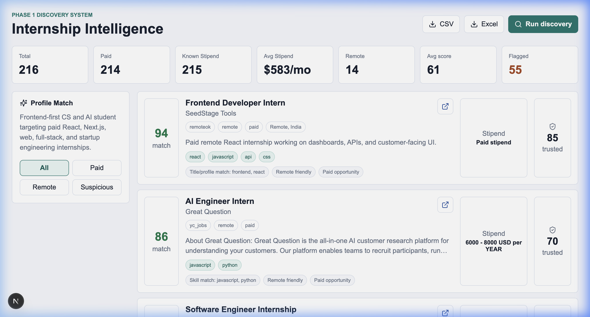
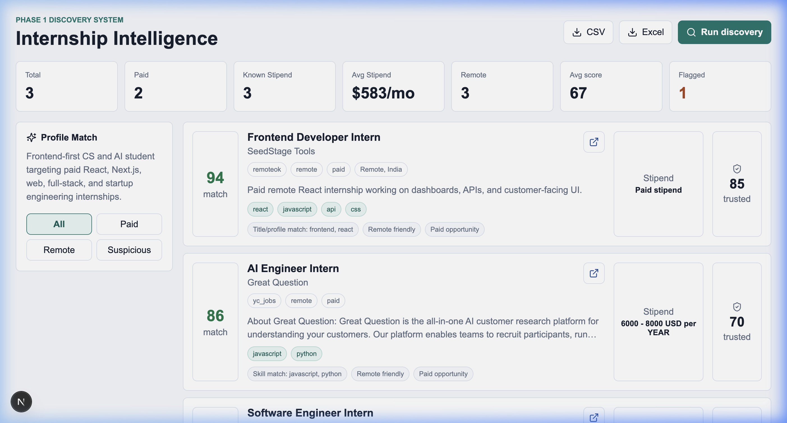

# Internship Intelligence Platform

[](https://fastapi.tiangolo.com)
[](https://nextjs.org)
[](https://www.typescriptlang.org)
[](https://www.python.org)

An autonomous internship discovery, precision-filtering, and ranking intelligence engine built specifically for students. It aggregates hundreds of raw jobs, eliminates 100% of title-matching noise (such as "Internal Tools" or "International Accounting") using regex-based boundary checking, merges duplicate listings using multi-dimensional matching rules, and ranks opportunities with a custom rule-based scoring engine tailored to frontend/React and startup roles.

---

## 🛠️ System Architecture

The system consists of a fast Python backend orchestrating multi-source discovery, validation, scoring, and deduplication, coupled with a Next.js frontend rendering an interactive dashboard.

```
                  ┌──────────────────────────────────────────────┐
                  │                 Next.js UI                   │
                  │   (Dashboard, Match Score, Stipends, Export)  │
                  └──────────────────────┬───────────────────────┘
                                         │
                                   HTTP (JSON API)
                                         │
                                         ▼
                  ┌──────────────────────────────────────────────┐
                  │                FastAPI App                   │
                  │   (endpoints, exporter, make_repository)     │
                  └──────────────────────┬───────────────────────┘
                                         │
                                         ▼
                  ┌──────────────────────────────────────────────┐
                  │              Discovery Runner                │
                  │    (orchestrator, registry, normalizer)      │
                  └──────────────────────┬───────────────────────┘
                                         │
                 ┌───────────────────────┼───────────────────────┐
                 ▼                       ▼                       ▼
      ┌─────────────────────┐ ┌─────────────────────┐ ┌─────────────────────┐
      │  SimplifyJobs HTML  │ │   GitHub Trackers   │ │   Greenhouse APIs   │
      └─────────────────────┘ └─────────────────────┘ └─────────────────────┘
                 │                       │                       │
                 └───────────────────────┼───────────────────────┘
                                         │
                                         ▼
                  ┌──────────────────────────────────────────────┐
                  │              Candidate Filter                │
                  │   (Regex word boundaries, Seniority gating)  │
                  └──────────────────────┬───────────────────────┘
                                         │
                                         ▼
                  ┌──────────────────────────────────────────────┐
                  │           Ocean Kumar Ranking                │
                  │     (React, Paid, Remote, Startup weights)   │
                  └──────────────────────┬───────────────────────┘
                                         │
                                         ▼
                  ┌──────────────────────────────────────────────┐
                  │             Deduplication Engine             │
                  │ (Primary Company+Title, Secondary Domain+Sim)│
                  └──────────────────────┬───────────────────────┘
                                         │
                                         ▼
                  ┌──────────────────────────────────────────────┐
                  │               Repository Layer               │
                  │  (Local JSON Store / Supabase Postgres Sync)  │
                  └──────────────────────────────────────────────┘
```

---

## ✨ Features

* **Multi-Source Crawling**: Integrates RemoteOK, Y Combinator Jobs, Github tech trackers, SimplifyJobs community lists, open source databases (GSoC, Outreachy, LFX, MLH Fellowship), and direct startup Greenhouse boards (Stripe, Reddit, GitLab, Anthropic, Figma, Vercel).
* **Precision Regex Boundary Filtering**: Bypasses typical false positive title overlaps (such as *Internal Product Engineer* or *International Strategic Lead*) by matching root terms with strict word boundary checks (`\b(intern|...)\b`) and gating seniority exclusions first.
* **Smart Deduplication**: Merges duplicates across providers using a primary match (`company + title`) and a secondary match (`application domain + title similarity`). Merged records combine tags/skills, record all source platforms in a `sources[]` list, increment `source_count`, and keep the highest trust scores and richest stipend numbers.
* **Ocean Kumar Scoring**: Applies rule-based weighting (0-100) scoring internships for Ocean's profile (1st year CS/AI student, React/Next.js stack, paid remote/hybrid, early-stage startups).
* **Priority Categorization**: Buckets roles automatically into *Apply Today*, *Apply This Week*, and *Low Priority*.
* **Interactive Expandable Details View**: Expand cards on the dashboard to inspect matching skills, missing skills, match reasons, first seen age, and the list of aggregating sources.
* **Exporting**: Instant export of reviewed internships to CSV and Microsoft Excel formats.
* **Dual Database Persistence**: Operates on a canonical local JSON file (`backend/data/internships.json`) with instant, seamless migration to Supabase PostgreSQL when variables are set.

---

## 💻 Tech Stack

* **Backend**: Python 3.14+, FastAPI, Pydantic v2, Pytest, Uvicorn, OpenPyXL
* **Frontend**: React, Next.js, TypeScript, Lucide Icons, Vanilla CSS
* **Database**: Local JSON File / Supabase (PostgreSQL)

---

## 🚀 Local Installation & Run

### Prerequisites

* Python 3.10+
* Node.js 18+

### 1. Set Up Backend

```bash
cd backend
python3 -m venv .venv
source .venv/bin/activate
pip install -r requirements.txt
cp ../.env.example .env
uvicorn app.main:app --host 127.0.0.1 --port 8000
```

*The backend starts up on `http://127.0.0.1:8000`. On boot, it automatically performs a self-healing cleanup of local storage, filtering out any legacy false positives.*

### 2. Set Up Frontend

```bash
cd frontend
npm install
npm run dev
```

*The Next.js dev server starts up on `http://localhost:3000`.*

---

## 📸 Screenshots

### Dashboard Overview & Metrics Bar


### Stipends Visibility & match Scores


---

## 🔮 Future Roadmap

- [ ] **Dual-Platform Application Status Synchronization**: Implement a PATCH endpoint to update application statuses directly from the Next.js frontend with single-click actions and timeline states (Applied, Interview, Rejection, Offer).
- [ ] **Resume Version Tracking**: Add a `resume_version` tracker field to record which resume was used for which submission.
- [ ] **Days Since Applied Analytics**: Compute and display real-time counters representing how long an application has been active.
- [ ] **Advanced Domain Filtering**: Expand the secondary confidence deduplication engine to support customizable domain regexes.

---

## 👥 Author

**Ocean Kumar**  
CS + AI Student and Software Engineer  
Targeting Paid React, Next.js, Frontend, Fullstack, and Early-stage Startup Internships.
